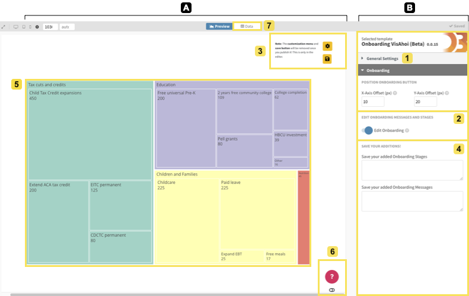

# Flourish Template
Based on the official template from [Flourish](https://github.com/kiln/flourish-sdk) in comibination with the custom self developed [visahoi](https://github.com/datavisyn/visAhoi) library the following templates have been created. They incoporate the method of Visualiaztion Onboarding and allow 
the useres of the template to define their own onboarding scenarios or adapt automatically generated ones. The templates work only for specific visualization types, which will be described for each teamplte individually.
 
 
__Background:__ 
 
_The authoring tool combines a Flourish template and the VisAhoi library. It provides a user interface to add onboarding and customize it:_
- editing, reordering, and/or removing the semi-automatically generated onboarding messages and onboarding stages, and
- adding own messages and stages.

_In general, the templates are divided into a fully customizable visualization area and the settings panel, which has limited customization possibilities._

 
 

## ⭐ Flourish Templates
### The Treemap 🌳

 

The proof-of-concept implementation of a self-explanatory visualization onboarding approach for data-journalistic use cases. The interface is divided into two areas: (A) preview with the visualization (5), the onboarding button (6), and the settings panel, 
and (B) Flourish (1) with the settings regarding onboarding customizations (2, 3, 4). Also, journalists can change the data of the treemap (7) provided by the Flourish template.
 
Link: http://bit.ly/3gBqrxv

 
 

## 📊 Data & Samples
Below you find a table with sample data. This data can be used in the flourish templates and is freely available. The data is described briefly, the source is given and for which flourish template it works.

| Name                          | Description                                                                                                                              | Type    | Download |
| ----------------------------- | ---------------------------------------------------------------------------------------------------------------------------------------- | ------- | -------- |
| Biden's Tax Overhaul [1]      | It shows the tax overhaul for families which was planned in 2021 and indicates all the different sectors and how much there is gathered. | Treemap | [Link]()     |
| Austrian Budget 2022 data [2] | It shows the federal budget plan of Austria for the year 2022 and the different sectors where it is spent.                               | Treemap | [Link]()     |

 

__References:__

[1] Probasco, J. (2021). What’s in joe biden’s $2.3 trillion american jobs
plan? https://www.investopedia.com/what-s-in-joe-biden-s-usd2-trillion-americanjobs-
plan-5120273. Accessed: 2022-05-02.

 

[2] Federal Ministry Republic of Austria Finance (2022). Federal ministry of finance — the
budget of austria, in figures and charts. https://bit.ly/3s6gJFC. Accessed:
2023-01-19.
