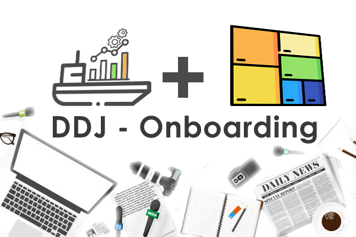

# Onboarding_DDJ_UseCase
Onboarding development and test for the DDJ use case. The repository contains three sub repositories. Each one responsible for different aspects of the project. All is part of the SEVA Project from
the university of applied sciences FHSTP. 

 

> Make sure to read all the necessary infromations within each project before working with them!

## 💻 Requirements

...

## 🚀 Installation

...

## 📫 Contribution & Credits
...

## 🤝 Collaborators
...

<!-- <table>
  <tr>
    <td align="center">
      <a href="#">
         
        
          <b>Iuri Silva</b>
        
      </a>
    </td>
    <td align="center">
      <a href="#">
         
        
          <b>Mark Zuckerberg</b>
        
      </a>
    </td>
    <td align="center">
      <a href="#">
         
        
          <b>Steve Jobs</b>
        
      </a>
    </td>
  </tr>
</table> -->

## 📝 License

MIT License
 
 
 
 
[⬆ To the Top](#Onboarding_DDJ_UseCase) 
